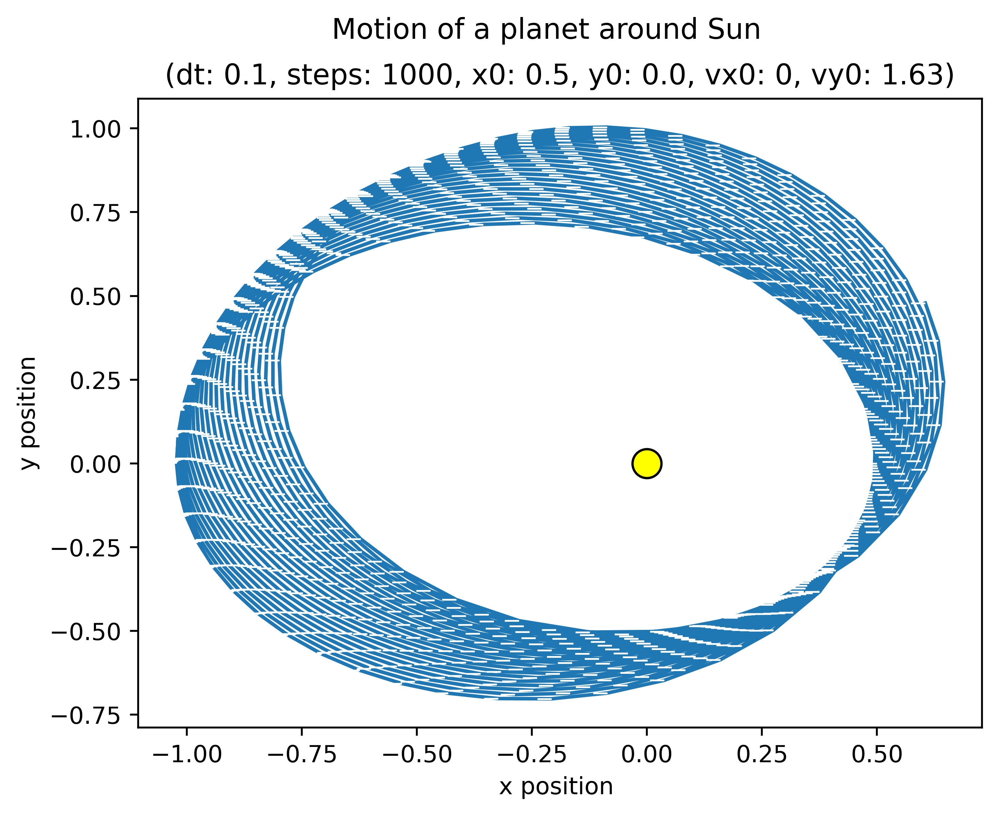
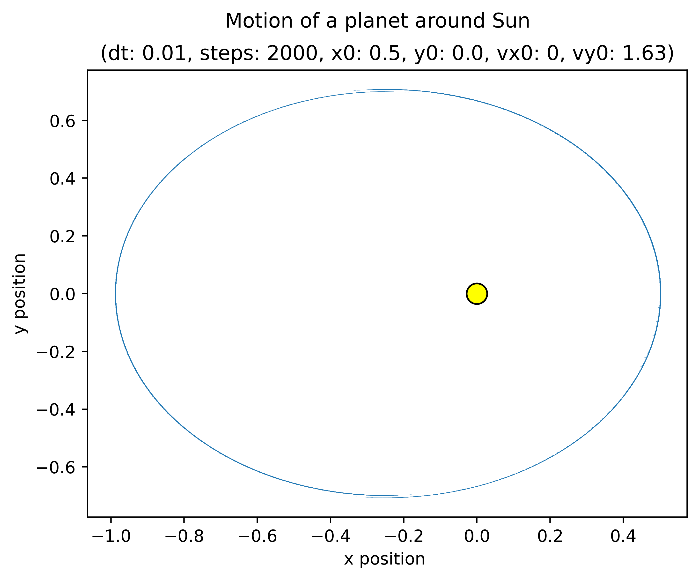
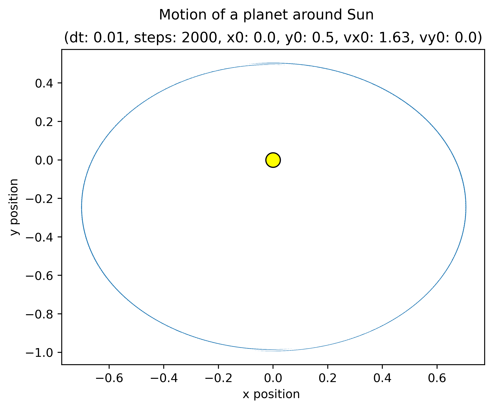
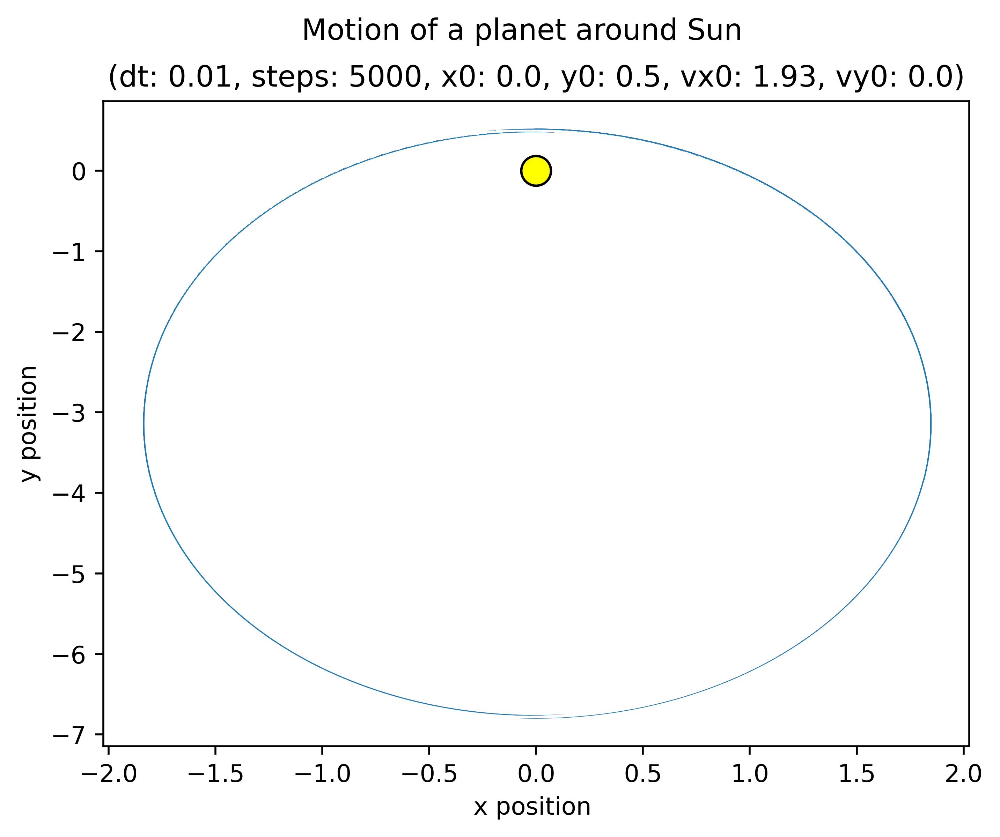
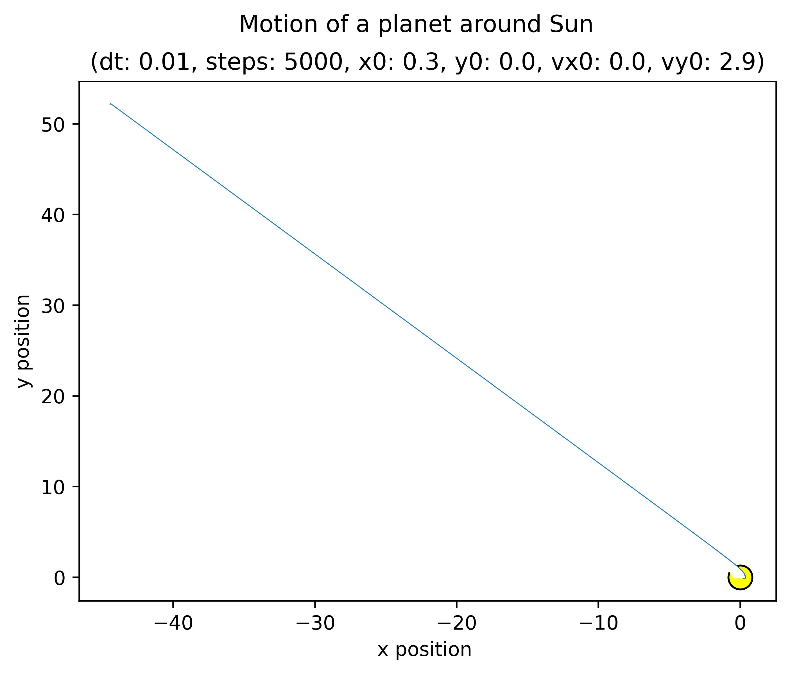
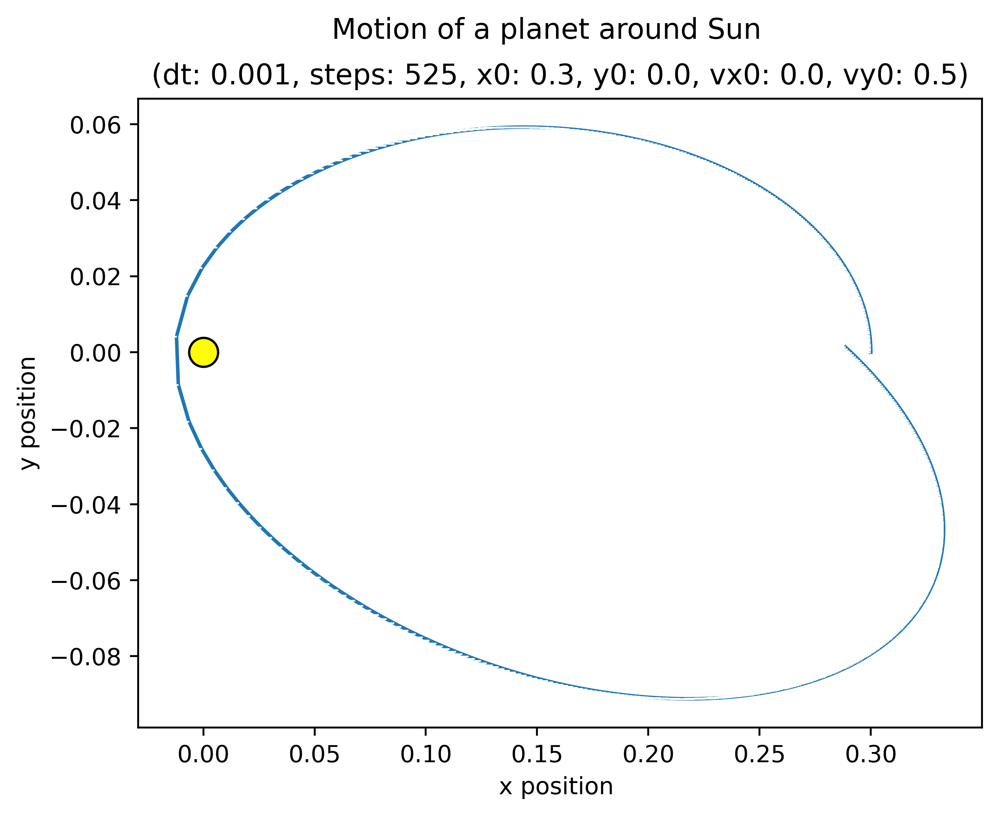

This code and report was written as part of a lab exercise for Theoretical Astrophysics Lab at Nicolaus Copernicus University.

Author@Sohaib


For a body orbiting a central mass, Newton's law of universal gravitation states:

$$
\mathbf{F} = -G \frac{M m}{r^2}\hat{\mathbf{r}} \quad (1)
$$

Where **F** is the force vector, G is the gravitational constant, M and m are the masses of central object and orbiting body respectively, r is the distance between them, **r̂** is the unit vector pointing along the line connecting the two masses, and the negative sign indicates that the force is attractive (directed toward the center). In this exercise, to simplify things and minimize numerical errors, we use normalized units G=M=1. This reduces (1) to:

$$
\mathbf{a} = -\frac{\hat{\mathbf{r}}}{r^2} \quad (2)
$$

Moreover, if we know the position and velocity of a body at a specific time t, we can use Newton's laws of motion to predict the trajectory of a particle in an N-dimensional space.

## 2. Methodology

We start by defining boundary conditions for the planet. We assume a two-dimensional space with *x*₀ and *y*₀ as initial position coordinates of the planet and the corresponding velocity components *vx*₀ and *vy*₀. We also assume that G and M in (1) are dimensionless and are equal to 1. Based on these initial positions and assumptions, I calculated *r*₀, *vx*₀,ₕₐₗf, *vy*₀,ₕₐₗf, *ax*₀, *ay*₀ using the following equations:

$$
r_0 = \sqrt{(x_0^2  + y_0^2)} \quad (3)
$$

$$
ax_0 = -x_0/r_0^3 \quad (4)
$$

$$
ay_0 = -y_0/r_0^3 \quad (5)
$$

$$
vx_{0,half} = vx_0 + ax_0(dt/2) \quad (6)
$$

$$
vy_{0,half} = vy_0 + ay_0(dt/2) \quad (7)
$$

Where *r*₀ is radial position at *x*₀ and *y*₀, *ax*₀ and *ay*₀ are accelerations due gravity at *x*₀ and *y*₀. Eqs. (4) and (5) are derived from (2). This was done to simplify our calculations for the orbit. As a consequence, no gravitational interaction was considered between the Sun and the planet. The half step velocities defined by (6) and (7) are a signature element of Leapfrog integration scheme in orbital dynamics. As per leapfrog method, half-step velocities allow the positions to be updated using a velocity value that represents an average between the current and future states. Feynmann [1] discusses the need to have mid-point velocities between two time-steps in order to not "miss-out" on the information about the motion of particles while computing its motion. By computing velocities at half-time steps, the algorithm effectively centers the update of positions and velocities in time, which leads to a local truncation error of order 3 and an overall second-order accurate integration.

## 3. Code Implementation
The above equations were translated into Python and a leapfrog integrator in the form of a python function was developed.

```python
#!/usr/bin/env python3
# -*- coding: utf-8 -*-
"""
Created on Wed Mar  5 14:29:09 2025

@author: sohaib
"""

import numpy as np
from tabulate import tabulate
import seaborn as sns
import matplotlib.pyplot as plt
import pandas as pd

def leapfrog(dt,steps,x0,y0,vx0,vy0):
    # ... (full code as provided) ...
    return

# 1st iteration - a coarse timestep
dt=0.1
steps=2000
x0=0.500
y0=0.000
vx0=0
vy0=1.630
# leapfrog(dt,steps,x0,y0,vx0,vy0)

# 2nd iteration
dt=0.01
steps=2000
x0=0.500
y0=0.000
vx0=0
vy0=1.630
leapfrog(dt,steps,x0,y0,vx0,vy0)
```
Using a coarse time step dt=0.100 in the first iteration leads to a Rosette-shaped orbit (Figure 1). A pseudo precession of the orbit often called numerical precession. The leapfrog method assumes that velocities at half-steps are good approximations for updating positions. However, if dt is too large, the velocity updates become less accurate. Due to a coarse time-step over a large number of steps i.e. 2000, the planet arrives at a slightly different position at the end of each iteration of loop. This leads to an open ellipse, consequently creating a precession-like effect that isn't physical. To make the large dt conform to the physical expectation, decreasing step-size dt to finer values e.g. dt=0.01 generates a perfectly elliptical orbit as shown in Figure 2.

The values of each parameters calculated using eqs. (2-7) during each iteration are shown in truncated tables 1 and 2. As expected, we see more precise half-step velocities in Table 2, meaning that we can now model the position of the planet much more accurately within each time-step. This consequently removes the observed numerical precession and generates a perfectly elliptical orbit.

Other combination of initial conditions also yield some interesting orbits shown in Figure 3. While Figures 3a and 3b are obtained just by exchanging the initial velocities and positions from x to y, Figure 3c represents a special orbit where increasing the velocity beyond a certain limit makes the Hamiltonian of the system positive, thereby, causing the planet to escape the system. Figure 3d shows the limitations of our integrator that even though finer time-steps lead to more realistic solutions, in some combination of initial conditions, errors continue to add up which consequently lead to "drifts" nonetheless.

## 4. Figures

### Figure 1

*Figure 1: Rosette-shaped orbit, a direct consequence of using a coarse time-step over a large time interval which leads to accumulation of truncation errors introduced during each time-step.*

### Figure 2

*Figure 2: An elliptical orbit of a planet with a closed ellipse.*

### Figure 3
*Figure 3: A montage of four different orbital scenarios demonstrating various initial conditions and outcomes.*
<table>
  <tr>
    <td align="center">
      
      <br><em>(a) Another example of a closed orbit at y₀=0.5</em>
    </td>
    <td align="center">
      
      <br><em>(b) Changing from a non-zero vᵧ to a non-zero vₓ</em>
    </td>
  </tr>
  <tr>
    <td align="center">
      
      <br><em>(c) An example of an unbound/hyperbolic orbit by increasing velocity (positive total energy)</em>
    </td>
    <td align="center">
      
      <br><em>(d) Limitations of the 2nd-order leapfrog method leading to drifts</em>
    </td>
  </tr>
</table>

## 5. Simulation Data

### 5.1. Iteration 1 - Coarse time-step
The simulation was initialized with *r*₀ = 0.5, *a*ₓ(0) = -4.0, *a*ᵧ(0) = -0.0, *v*ₓ(e/2) = -0.02, and *v*ᵧ(e/2) = 1.63. Table 1 presents the time evolution data. The second row after each full step contains the half-step velocity values.

**Table 1. Iteration 1 with dt=0.1**
| Time  | *x*     | *y*     | *a*ₓ    | *a*ᵧ    | *v*ₓ    | *v*ᵧ    | *r*     |
| :---- | :------ | :------ | :------ | :------ | :------ | :------ | :------ |
| 0.000 | 0.500   | 0.000   | -4.000  | -0.000  | 0.000   | 1.630   | 0.500   |
|       |         |         |         |         | -0.200  | 1.630   |         |
| 0.100 | 0.480   | 0.163   | -3.685  | -1.251  | -0.384  | 1.567   | 0.507   |
|       |         |         |         |         | -0.568  | 1.505   |         |
| ...   | ...     | ...     | ...     | ...     | ...     | ...     | ...     |
| 2.100 | -1.022  | 0.002   | 0.957   | -0.002  | 0.009   | -0.797  | 1.022   |
|       |         |         |         |         | 0.057   | -0.797  |         |
*Note: The second row after each full time step contains half-step velocity values.*

### 5.2. Iteration 2 - Fine time-step
The simulation was initialized with *r*₀ = 0.5, *a*ₓ(0) = -4.0, *a*ᵧ(0) = -0.0, *v*ₓ(e/2) = -0.2, and *v*ᵧ(e/2) = 1.63. Table 2 presents the time evolution data. Note that the second row after each full time step contains the half-step velocity values.

**Table 2. Iteration 2 with dt=0.01**
| Time  | *x*     | *y*     | *a*ₓ    | *a*ᵧ    | *v*ₓ    | *v*ᵧ    | *r*     |
| :---- | :------ | :------ | :------ | :------ | :------ | :------ | :------ |
| 0.000 | 0.500   | 0.000   | -4.000  | -0.000  | 0.000   | 1.630   | 0.500   |
|       |         |         |         |         | -0.020  | 1.630   |         |
| 0.010 | 0.500   | 0.016   | -3.997  | -0.130  | -0.040  | 1.629   | 0.500   |
|       |         |         |         |         | -0.060  | 1.629   |         |
| ...   | ...     | ...     | ...     | ...     | ...     | ...     | ...     |
| 0.210 | 0.417   | 0.324   | -2.839  | -2.205  | -0.752  | 1.372   | 0.527   |
|       |         |         |         |         | -0.767  | 1.361   |         |
*Note: The second row after each full time step contains half-step velocity values.*

---

## References

1.  Feynman, R. P., Leighton, R. B., & Sands, M. (1964). *The Feynman Lectures on Physics: Volume I, Chapter 9*. Available at: https://www.feynmanlectures.caltech.edu/I_09.html (Accessed: March 10, 2025).
2.  Hairer, E., Lubich, C., & Wanner, G. (2006). *Geometric Numerical Integration: Structure-Preserving Algorithms for Ordinary Differential Equations*. Springer, Berlin.
3.  Press, W. H., Teukolsky, S. A., Vetterling, W. T., & Flannery, B. P. (2007). *Numerical Recipes: The Art of Scientific Computing* (3rd ed.). Cambridge University Press, Cambridge.
